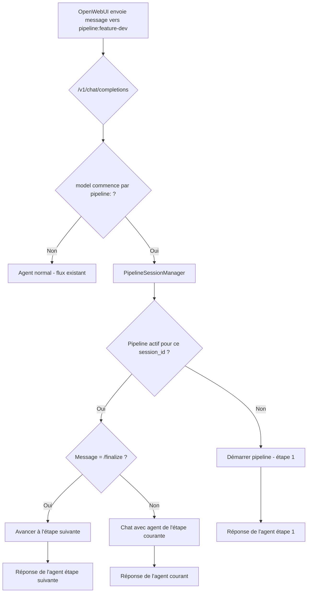

# Plan : Consolidation agents, config manquante, pipelines OpenWebUI

## 1. Diagnostic : Chevauchement agents code/expert/developer

### Cartographie actuelle

| Agent | Rôle | web: | Classe Python | config.yaml | Différenciateur |
|-------|------|------|---------------|-------------|-----------------|
| **expert** | Senior fullstack — Code Q&A, review, debug | yes | Aucune (BaseAgent générique) | ✅ Présent | Agent principal, pas de reasoning_effort |
| **code** | Senior fullstack — Code Q&A, review, debug, **implementation** | yes | `CodeAgent` (no-op wrapper) | ❌ Absent | `reasoning_effort: high`, cap Implementation |
| **developer** | Senior dev — produit des **git diffs** | no | `DeveloperAgent` (avec /apply, /diff…) | ✅ Présent | Workflow diff-based, commands spécifiques |

### Constat

- **expert** et **code** sont quasi-identiques : même rôle "senior fullstack", mêmes capacités (Q&A, review, debug, architecture, refactoring). La seule différence : `code` ajoute "Implementation" et `reasoning_effort: high`.
- **developer** est fondamentalement différent : il produit des diffs git, a des commands (/apply, /diff, /show, /tree), et un workflow dédié.
- La classe `CodeAgent` est un wrapper vide autour de `BaseAgent` — sa seule logique est un `post_process` qui wrappe le code dans des backticks si absent (questionnable).

### Recommandation

**Merger code → expert** en enrichissant expert :

```
expert (merged):
  - model: code
  - temperature: 0.3
  - extra_params:
      reasoning_effort: "high"
  - Capabilities: Code Q&A, Review, Debugging, Architecture, Refactoring + Implementation
```

**Garder developer séparé** — son workflow diff-based est orthogonal.

---

## 2. Diagnostic : Entrées manquantes dans config.yaml

5 agents ont un fichier `.md` et une classe Python, mais **aucune entrée** dans la section `agents:` de `config.yaml` :

| Agent | Config dans .md | Impact de l'absence dans config.yaml |
|-------|-----------------|--------------------------------------|
| **architect** | model: heavy, temp: 0.2, reasoning_effort: high | Fonctionne car le .md définit ces valeurs, mais pas de single source of truth |
| **ask** | model: light, temp: 0.3, max_tokens: 1000 | Idem |
| **debug** | model: code, temp: 0.1, reasoning_effort: high | Idem |
| **orchestrator** | model: heavy, temp: 0.15, reasoning_effort: high | Idem |
| **code** | model: code, temp: 0.3, reasoning_effort: high | Sera mergé dans expert |

**Note technique** : Le code dans `web/server.py` résout le modèle en cascade : `.md config` → `config.yaml agents:` → défaut. Donc ça "marche" sans l'entrée config.yaml, mais c'est fragile et incohérent.

### Bug YAML : doublon `extensions` dans rag:

Dans `config.yaml`, la section `rag:` contient **deux clés `extensions:`** (lignes 148-175 et 197-223). YAML garde la dernière, la première est silencieusement ignorée. Il faut fusionner les deux listes et supprimer le doublon.

---

## 3. Diagnostic : Pipelines inaccessibles depuis OpenWebUI

### État actuel

```mermaid
graph LR
    subgraph Workspace UI
        A[Bouton Pipeline] --> B[/api/ws/pipeline/start]
        B --> C[SessionManager]
        C --> D[Pipeline multi-étapes]
    end
    subgraph OpenWebUI
        E[/v1/chat/completions] --> F[Agent unique]
        F --> G[Réponse simple]
    end
    D -.->|Pas de pont| E
```

- Les pipelines sont accessibles **uniquement** via le Workspace UI (`/workspace`)
- L'API OpenAI-compatible (`/v1/models`, `/v1/chat/completions`) n'expose que des agents individuels
- Le pipeline `feature-dev` a `openwebui: yes` dans sa définition, mais rien dans le code ne l'utilise

### Ce qu'il faut pour OpenWebUI

OpenWebUI fonctionne en request/response stateless. Pour exposer un pipeline :

1. **Exposer chaque pipeline comme un modèle** dans `/v1/models` (ex: `pipeline:feature-dev`)
2. **Créer une session pipeline** quand un utilisateur envoie un message au modèle pipeline
3. **Chaque message = une étape** : l'utilisateur chat, l'agent courant répond, puis l'utilisateur peut envoyer `/finalize` pour passer à l'étape suivante
4. **Gérer le state** via le session_id (déjà présent via `X-Session-Id`)

### Design proposé



---

## 4. Plan d'action

### Phase 1 : Consolidation agents

- [ ] **Merger `code` → `expert`** :
  - Enrichir `agents/defs/expert.md` avec les capacités Implementation + anti-hallucination rules de code
  - Ajouter `reasoning_effort: high` dans la config de expert dans `config.yaml`
  - Supprimer `agents/defs/code.md`
  - Supprimer `src/agents/code.py`
  - Retirer `code` de `AGENT_CLASSES` et `ALL_WORKSPACE_AGENTS` dans `workspace_session.py`
  - Retirer `code` de `GLOBAL_AGENT_NAMES`

- [ ] **Garder developer séparé** (workflow diff distinct)

### Phase 2 : Config.yaml — corriger les lacunes

- [ ] **Ajouter les 4 agents manquants** dans la section `agents:` de config.yaml :
  ```yaml
  architect:
    model: heavy
    temperature: 0.2
    extra_params:
      reasoning_effort: "high"
  ask:
    model: light
    temperature: 0.3
    extra_params:
      max_tokens: 1000
  debug:
    model: code
    temperature: 0.1
    extra_params:
      reasoning_effort: "high"
  orchestrator:
    model: heavy
    temperature: 0.15
    extra_params:
      reasoning_effort: "high"
  ```

- [ ] **Fusionner le doublon `extensions`** dans la section `rag:` de config.yaml (supprimer la deuxième occurrence redondante)

- [ ] **Mettre à jour expert** dans config.yaml avec `reasoning_effort` :
  ```yaml
  expert:
    model: code
    temperature: 0.3
    extra_params:
      reasoning_effort: "high"
  ```

### Phase 3 : Pipelines accessibles depuis OpenWebUI

- [ ] **Exposer les pipelines dans `/v1/models`** : ajouter les pipelines avec `openwebui: yes` comme modèles préfixés `pipeline:`
- [ ] **Créer un `PipelineSessionManager`** léger qui gère l'état des pipelines par session_id (réutiliser la logique de `WorkspaceSession`)
- [ ] **Modifier `/v1/chat/completions`** pour détecter les modèles pipeline et router vers le PipelineSessionManager
- [ ] **Gérer les commandes pipeline** : `/finalize` → étape suivante, `/skip` → skip, etc.
- [ ] **Ajouter le contexte pipeline** dans la réponse (metadata sur l'étape courante, progression)

### Phase 4 : Nettoyage

- [ ] Supprimer `src/agents/code.py` et `agents/defs/code.md`
- [ ] Nettoyer les imports dans `workspace_session.py`
- [ ] Vérifier que `CORE_AGENTS` dans `agent_defs.py` est à jour
- [ ] Tester l'ensemble : Web UI, Workspace, OpenWebUI
